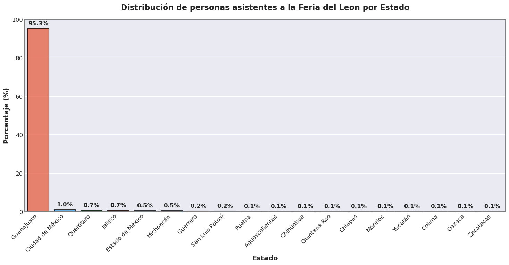
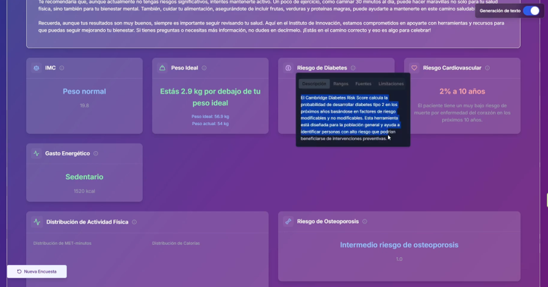
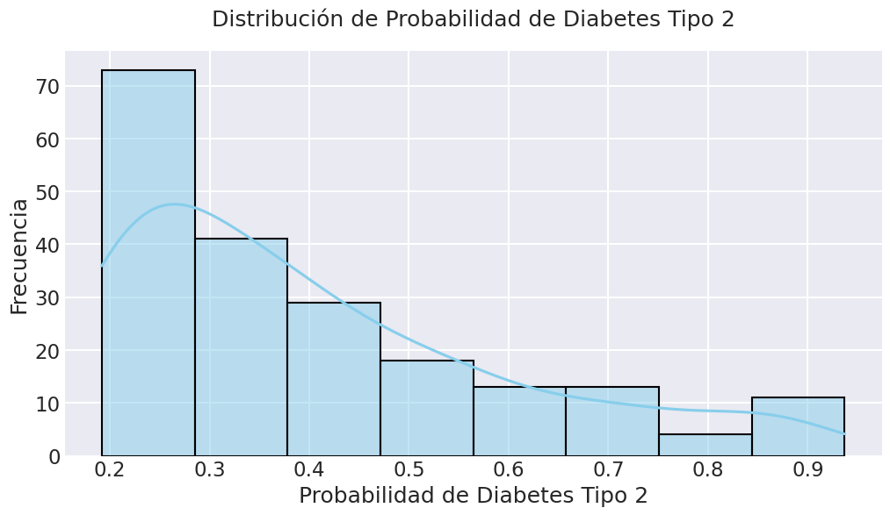

<div align="center">

# 🌟 Análisis de Datos: Mapa de Bienestar 🌟

[](https://opensource.org/licenses/MIT)
[](https://www.python.org/)
[](https://jupyter.org/)
[]()  
[]()


</div>

## 📋 Descripción

Este proyecto presenta un análisis de datos realizado durante la **Feria de León 2025**, donde se implementó el "Mapa de Bienestar", una iniciativa innovadora para evaluar parámetros de salud de los asistentes mediante encuestas que incluyeron datos generales (edad, presión arterial, antecedentes médicos, etc.) y escalas clínicas validadas internacionalmente.

> *"El Mapa de Bienestar representa un enfoque innovador para acercar herramientas de evaluación de la salud a la población general, utilizando tecnología de vanguardia para democratizar el acceso a información médica personalizada."*

Los resultados fueron procesados y presentados a través de un dashboard interactivo donde un modelo de lenguaje explicaba la información personalizada a cada usuario. Este notebook (`wellness_map_analysis.ipynb`) contiene el análisis de los datos agregados recolectados durante el evento.

## 📁 Estructura del Proyecto

| Archivo | Descripción |
|---------|-------------|
| 📊 `wellness_map_analysis.ipynb` | Notebook principal con el análisis, visualizaciones y conclusiones |
| 🔒 `data/data-mapa-bienestar.csv` | Archivo de datos utilizado en el análisis (**no se publica por protección de datos personales**) |
| 📜 `LICENSE` | Licencia MIT para el uso y distribución del código |

## 🎯 Objetivos

<div align="center">

</div>

### 🌍 Objetivo General

> Analizar los datos de bienestar recolectados durante la Feria de León 2025, identificar patrones epidemiológicos y generar visualizaciones útiles para la toma de decisiones en salud pública.

### 📊 Objetivos Específicos

- ✅ Caracterizar a la población asistente a la Feria de León 2025 en términos demográficos y de salud.
- ✅ Identificar la prevalencia de factores de riesgo cardiovascular, respiratorio y osteomuscular.
- ✅ Evaluar el nivel de actividad física y comportamientos sedentarios.
- ✅ Detectar posibles casos de subdiagnóstico en condiciones prevalentes como diabetes e hipertensión.
- ✅ Generar información útil para el diseño de programas preventivos y de promoción de la salud.

## 📊 Descripción de los Datos

El archivo `data/data-mapa-bienestar.csv` contiene los datos utilizados en el análisis (**no se publica por protección de datos personales**). Los datos fueron recolectados mediante encuestas aplicadas a los asistentes de la Feria de León 2025 tras obtener su consentimiento informado.

<div align="center">

</div>

### 🏥 Escalas Clínicas Aplicadas

El proyecto utilizó las siguientes escalas y herramientas validadas internacionalmente:

<table>
  <tr>
    <th>Escala</th>
    <th>Descripción</th>
    <th>Aplicación</th>
  </tr>
  <tr>
    <td>📏 <b>IMC (BMI)</b></td>
    <td>Índice de Masa Corporal</td>
    <td>Clasificación del estado nutricional</td>
  </tr>
  <tr>
    <td>🩸 <b>Cambridge Diabetes Risk Score</b></td>
    <td>Puntuación de riesgo de diabetes</td>
    <td>Evaluación del riesgo de diabetes tipo 2</td>
  </tr>
  <tr>
    <td>⚖️ <b>Peso corporal ideal y ajustado</b></td>
    <td>Cálculos antropométricos</td>
    <td>Estimación de parámetros antropométricos óptimos</td>
  </tr>
  <tr>
    <td>🔥 <b>Tasa metabólica basal</b></td>
    <td>Metabolismo basal</td>
    <td>Cálculo del gasto energético en reposo</td>
  </tr>
  <tr>
    <td>🏃 <b>IPAQ</b></td>
    <td>International Physical Activity Questionnaire</td>
    <td>Evaluación estandarizada de actividad física</td>
  </tr>
  <tr>
    <td>❤️ <b>Globorisk</b></td>
    <td>Riesgo cardiovascular global</td>
    <td>Estimación del riesgo cardiovascular</td>
  </tr>
  <tr>
    <td>🚬 <b>Índice tabáquico</b></td>
    <td>Exposición al tabaco</td>
    <td>Cuantificación de la exposición al tabaco</td>
  </tr>
  <tr>
    <td>💪 <b>SARC-F</b></td>
    <td>Cuestionario de sarcopenia</td>
    <td>Detección del riesgo de sarcopenia</td>
  </tr>
  <tr>
    <td>🫁 <b>COPD Population Screener</b></td>
    <td>Tamizaje pulmonar</td>
    <td>Tamizaje para Enfermedad Pulmonar Obstructiva Crónica</td>
  </tr>
  <tr>
    <td>🦴 <b>OST</b></td>
    <td>Osteoporosis Self Assessment Tool</td>
    <td>Herramienta de autoevaluación para osteoporosis</td>
  </tr>
  <tr>
    <td>👚 <b>Modelo de Gail</b></td>
    <td>Modelo predictivo</td>
    <td>Estimación del riesgo de cáncer de mama</td>
  </tr>
</table>

## 🔬 Metodología

### 📱 Recolección de Datos

Los datos fueron recolectados mediante encuestas digitales durante la Feria de León 2025. Los participantes proporcionaron información demográfica, médica y contestaron cuestionarios estandarizados validados internacionalmente.

### 🧮 Procesamiento y Análisis

El análisis se realiza en Python, aprovechando bibliotecas como pandas, matplotlib, seaborn y otras herramientas de visualización y análisis de datos.

```python
# Ejemplo de código para análisis de datos
import pandas as pd
import matplotlib.pyplot as plt
import seaborn as sns

# Cargar los datos
data = pd.read_csv('data/data-mapa-bienestar.csv')

# Eliminar registros de prueba
data = data[~data['name'].isin(nombres_de_prueba)]

# Visualizar distribución de edad
plt.figure(figsize=(10, 6))
sns.histplot(data['age_years'], bins=20, kde=True)
plt.title('Distribución de Edades')
plt.xlabel('Edad (años)')
plt.ylabel('Frecuencia')
plt.show()
```

El notebook documenta paso a paso:

1. 🧹 **Limpieza de datos**: Eliminación de registros de prueba, manejo de valores atípicos, etc.
2. 📊 **Exploración descriptiva**: Análisis de variables clave
3. 👥 **Análisis por grupos**: Estadísticas por grupos demográficos
4. 📝 **Procesamiento de escalas**: Cálculo de puntuaciones normalizadas
5. 📈 **Generación de visualizaciones**: Identificación de patrones relevantes

### 💻 Dashboard y Modelo de Lenguaje

<div align="center">

</div>

Los resultados fueron integrados en un dashboard interactivo donde los participantes podían revisar sus resultados personales. Un modelo de lenguaje natural proporcionaba explicaciones personalizadas sobre los hallazgos y recomendaciones basadas en la evidencia científica.


---

## 📊 Principales Análisis y Resultados

<div align="center">

</div>

El análisis realizado en el notebook abarca las siguientes áreas clave:

### 1. Exploración y Limpieza de Datos
- Importación de los datos recolectados en la Feria de León 2025.
- Eliminación de registros de prueba para asegurar la calidad del análisis.
- Revisión de las variables y su integridad (83 columnas, 1556 registros tras limpieza).

### 2. Análisis Demográfico
- **Edad:**
  - Rango: 3 a 152 años (media: 31.8 años).
  - Distribución de grupos de edad en intervalos de 10 años.
  - Visualización: gráfico de barras por grupos de edad.
- **Sexo:**
  - 59.4% mujeres, 40.6% hombres.
  - Visualización: gráfico de barras y pastel.
- **Ubicación:**
  - Distribución por país, estado y municipio.
  - Visualización: gráficos de barras con porcentajes.
- **Etnicidad:**
  - Análisis de la diversidad étnica de la muestra.

### 3. Género y Salud Femenina
- Edad al primer periodo menstrual, familiares con cáncer de mama, edad al primer parto y biopsias previas.
- Gráficos de barras para cada variable.

### 4. Tabaquismo
- Estado de tabaquismo (fumador actual, exfumador, nunca fumador).
- Distribución de cigarrillos por día y años de exposición al tabaco entre fumadores y exfumadores.
- Estadísticas clave: media de años de exposición ~9.6 años.
- Visualizaciones: histogramas y gráficos de barras.

### 5. Antropometría y Actividad Física
- Altura (media: 159.7 cm) y peso (media: 67.8 kg), distribuidos por sexo y grupo etario.
- Comparación entre peso real e ideal, análisis de BMI (índice de masa corporal):
  - 7.9% bajo peso, 38.2% peso normal, 32.1% sobrepeso, 19.8% obesidad, 2.0% obesidad mórbida.
- Visualizaciones: boxplots, histogramas, scatterplots y líneas de tendencia LOWESS.

### 6. Riesgos y Salud Cardiovascular
- Distribución de caídas en el último año y por grupo de edad.
- Análisis de presión arterial sistólica (media: 119 mmHg) y prevalencia de hipertensión (8.9% diagnosticados vs 35% estimados, mostrando subdiagnóstico).
- Visualizaciones: histogramas, gráficos de barras y pastel.

## Conclusiones
- La muestra es predominantemente joven, con ligera mayoría femenina.
- Se identifican patrones de sobrepeso y obesidad relevantes para la salud pública.
- Existe un subdiagnóstico importante de hipertensión en la población analizada.
- El análisis permite identificar grupos de riesgo y orientar estrategias de intervención.


---

## 💻 Requisitos Técnicos

<div align="center">

[](https://www.python.org/)
[](https://pandas.pydata.org/)
[](https://matplotlib.org/)
[](https://jupyter.org/)

</div>

### 🛠️ Dependencias

| Biblioteca | Propósito | Versión |
|------------|-----------|--------|
| 🐼 pandas | Procesamiento y análisis de datos | 1.0+ |
| 📊 matplotlib | Visualización de datos (gráficos básicos) | 3.0+ |
| 📈 seaborn | Visualización de datos (gráficos estadísticos) | 0.11+ |
| 📓 jupyter | Entorno interactivo para notebooks | 1.0+ |
| 🔢 numpy | Operaciones numéricas y estadísticas | 1.18+ |
| 🧠 scikit-learn | Análisis estadísticos avanzados | 0.22+ (opcional) |

### ⚙️ Instalación

```bash
# Crear un entorno virtual (recomendado)
python -m venv venv
source venv/bin/activate   # En Windows: venv\Scripts\activate

# Instalar dependencias
pip install pandas matplotlib seaborn jupyter numpy scikit-learn
```


---

## 🚀 Uso

1. 📥 **Clona el repositorio** o descarga los archivos:
   ```bash
   git clone https://github.com/DiegoLerma/wellness_map_data_analysis.git
   cd wellness_map_data_analysis
   ```

2. 📓 **Abre el notebook** `wellness_map_analysis.ipynb` con Jupyter Notebook o JupyterLab:
   ```bash
   jupyter lab
   # o
   jupyter notebook
   ```

3. ▶️ **Ejecuta las celdas** para reproducir el análisis y visualizar los resultados.

## 🌟 Aplicaciones y Relevancia

<div align="center">

| Área | Aplicación |
|------|------------|
| 🏥 **Salud pública** | Identificación de patrones de riesgo en una población específica |
| 🔍 **Medicina preventiva** | Detección temprana de factores de riesgo modificables |
| 📝 **Planificación** | Diseño de programas basados en necesidades reales identificadas |
| 💬 **Comunicación innovadora** | Uso de modelos de lenguaje para explicar información médica compleja |

</div>

## 🔒 Consideraciones Éticas

> Los datos presentados en este análisis han sido anonimizados y se manejan siguiendo los principios de la ética médica y la normativa de protección de datos. El proyecto cuenta con las autorizaciones correspondientes para el uso de la información con fines de análisis y mejora de programas de salud.


---

## 📜 Licencia

<div align="center">

[](https://opensource.org/licenses/MIT)

</div>

Este proyecto está bajo la Licencia MIT. Consulta el archivo [`LICENSE`](LICENSE) para más detalles.

---

<div align="center">

### 👨‍💻 Autor

**Diego Cesar Lerma Torres**

[](https://www.linkedin.com/in/diegocesarlerma/)
[](https://github.com/DiegoLerma)

*Proyecto implementado durante la Feria de León 2025*

</div>